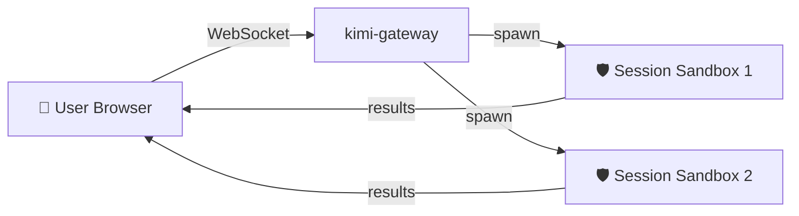
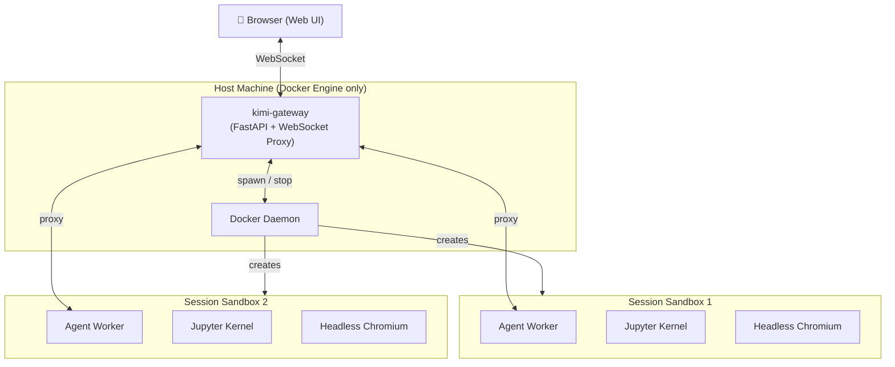

<p align="center">
  <h1 align="center">OpenKimo</h1>
  <p align="center"><strong>One Docker. Zero Worries.</strong></p>
  <p align="center">A containerized server-side agent platform that runs in one command.<br>Fully isolated sessions. Multi-LLM ready.</p>
  <p align="center">
    🚀 One-Command Deploy &nbsp;|&nbsp; 🛡️ Secure by Default &nbsp;|&nbsp; 🔌 Multi-LLM
  </p>
</p>

<p align="center">
  <a href="https://opensource.org/licenses/Apache-2.0">
    
  </a>
  <a href="https://www.docker.com/">
    
  </a>
  <a href="#">
    
  </a>
  <a href="#">
    
  </a>
  <a href="https://github.com/j0x7c4/OpenKimo">
    
  </a>
  <a href="https://github.com/j0x7c4/OpenKimo/releases">
    
  </a>
</p>

---

## What is OpenKimo?

OpenKimo is a **containerized server-side agent platform**. You operate the agent through a web browser, while all code execution tasks run inside sandboxed Docker containers — nothing executes on the host machine.

- **One command** to deploy the entire stack (`docker-compose up -d`).
- **One browser tab** to create sessions, chat with the agent, and review outputs.
- **Zero host dependencies** — the machine only needs Docker Engine installed.



## Demos

- 🎬 [Quick Start Demo] (coming soon)
- 🔒 [Sandbox Security Demo] (coming soon)
- 🔌 [Multi-LLM Switch Demo] (coming soon)

## Quick Start

> **Only Docker Engine is required.** No Python, Node.js, or other build tools on the host.
> Pre-built images are hosted on GitHub Container Registry — no local build needed.

### Prerequisites

- [Docker](https://docs.docker.com/get-docker/)
- [Docker Compose](https://docs.docker.com/compose/install/)

### Option A — No Git Clone Required (Fastest)

```bash
# 1. Download config files
curl -O https://raw.githubusercontent.com/j0x7c4/OpenKimo/main/docker-compose.yml
curl -O https://raw.githubusercontent.com/j0x7c4/OpenKimo/main/.env.example
cp .env.example .env

# 2. Edit .env — set at least one LLM API key
# 3. Pull images and start
docker compose up -d
```

### Option B — Clone & Deploy Wizard

```bash
git clone --recurse-submodules git@github.com:j0x7c4/OpenKimo.git
cd OpenKimo
./scripts/deploy.sh
```

The wizard configures your `.env` and pulls pre-built images automatically.

### Option C — Local Build (Developers)

```bash
git clone --recurse-submodules git@github.com:j0x7c4/OpenKimo.git
cd OpenKimo
cp .env.example .env
# Edit .env and set at least one LLM API key
docker-compose build
docker-compose up -d
```

### Access Web UI

Open http://localhost:5494 in your browser.

#### Default Admin Account

| Field    | Value     |
|----------|-----------|
| Username | `admin`   |
| Password | `admin123` |

> **Important:** Change the default password immediately after first login via the admin panel at `/admin`.

If Bearer token authentication is also enabled, append your token to the URL:

```
http://localhost:5494/?token=<your-token>
```

## Who is this for?

- **Solo developers** who want to deploy an AI Agent backend in minutes, not hours.
- **Small teams** that need a shared agent infrastructure without managing Python/Node.js runtimes on every machine.
- **Security-sensitive environments** where code must never run on the host filesystem.
- **Teams doing OEM or private deployments** who need to white-label the platform with their own branding.
- **Kimi / Moonshot users** looking for a native, containerized integration with their existing workflow.

## Features

### 🚀 One-Command Deploy
`docker-compose up -d` brings up the entire platform. No runtime installation, no dependency hell.

### 🛡️ Secure by Default
Every session is **forced** to run in its own isolated Docker container — not an optional plugin, not a configuration toggle. It is the architecture.

### 🌐 Web-Native
A single browser tab handles session creation, chat, file review, and admin. No WhatsApp bots, no Telegram channels, no desktop apps to install.

### 🔌 Multi-LLM
Switch between Kimi (Moonshot), OpenAI, and Anthropic (Claude) with a single environment variable.

### 📊 Resource Limits
Per-container CPU, memory, disk, and PID caps via cgroup — your host stays protected even under heavy agent workloads.

### 🧪 Built-in Tools
Jupyter Kernel + Headless Chromium + Shell execution ready out of the box. No extra plugin installations.

### 👥 Multi-User & Access Control
Built-in user management with role-based access control. Each user sees only their own sessions. Admin dashboard for user lifecycle management.

### 🎨 White-Label Branding
Customize logo, brand name, page title, and favicon directly from the admin panel — no code changes or rebuilds required. Perfect for OEM and private deployments.

### 🔌 Extensible UI Plugins
Inject custom React components into the agent lifecycle via an event-driven plugin system. Visualize thinking processes, sub-agent clusters, or any custom overlay without touching core code.

## Architecture

OpenKimo uses a two-container architecture: a **gateway** that proxies traffic and orchestrates sandboxes, and a **sandbox** template that is cloned per session.

- **kimi-gateway** — FastAPI web server, WebSocket session proxy, container orchestration.
- **Session Sandbox** — One Docker container per session. Runs the agent worker, Jupyter kernel, and headless Chromium browser.
- **Host** — Only needs Docker Engine. No Python, Node.js, or other runtimes required.



## Configuration

All configuration is done via environment variables in `.env`:

| Variable | Required | Description |
|----------|----------|-------------|
| `KIMI_API_KEY` | Yes* | Kimi / Moonshot API key |
| `OPENAI_API_KEY` | Yes* | OpenAI API key |
| `ANTHROPIC_API_KEY` | Yes* | Anthropic API key |
| `LLM_PROVIDER` | No | Default provider (`kimi` / `openai` / `anthropic`) |
| `KIMI_WEB_SESSION_TOKEN` | No | Bearer token for web UI auth |
| `KIMI_WEB_PORT` | No | Web server port (default: `5494`) |
| `SANDBOX_CPU_LIMIT` | No | Per-session CPU limit (default: `2`) |
| `SANDBOX_MEMORY_LIMIT` | No | Per-session memory limit (default: `4g`) |

\* At least one API key is required.

See [`.env.example`](.env.example) for the full list.

## OpenKimo vs Others

**OpenKimo is NOT trying to be your personal chat companion.** If you want an AI that lives in WhatsApp or Telegram, check out other projects in that space.

**OpenKimo IS for you if:**

- You need a **server-side agent** that runs 24/7 and is accessed via a browser.
- You want **zero host contamination** — every code execution happens inside a throwaway container.
- You prefer **infrastructure as code** — deploy, scale, and upgrade with Docker Compose.
- You use **Kimi / Moonshot** and want a native containerized integration rather than a wrapper script.

## Contributing

We welcome contributions! Please see [CONTRIBUTING.md](CONTRIBUTING.md) for guidelines.

## License

This project is licensed under the [Apache License 2.0](LICENSE).

---

<p align="center">
  If OpenKimo saves you time, please consider giving us a ⭐ on <a href="https://github.com/j0x7c4/OpenKimo">GitHub</a>!
</p>
