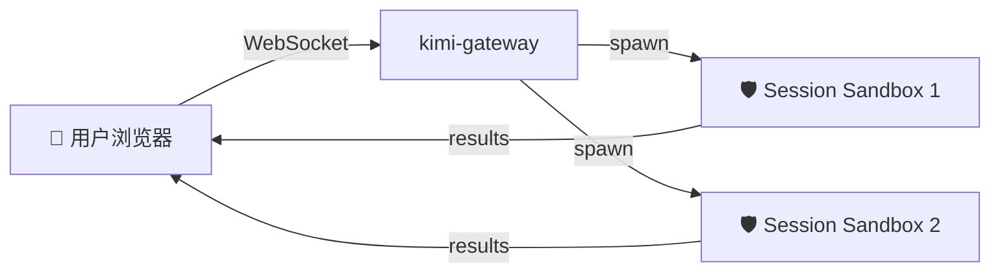
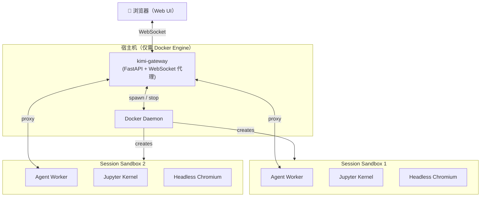

<p align="center">
  <h1 align="center">OpenKimo</h1>
  <p align="center"><strong>一条命令，开箱即用</strong></p>
  <p align="center">一键部署的容器化 AI Agent 平台。<br>会话完全隔离，多模型支持，零宿主机依赖。</p>
  <p align="center">
    🚀 一键部署 &nbsp;|&nbsp; 🛡️ 默认安全 &nbsp;|&nbsp; 🔌 多模型支持
  </p>
</p>

<p align="center">
  <a href="https://opensource.org/licenses/Apache-2.0">
    
  </a>
  <a href="https://www.docker.com/">
    
  </a>
  <a href="#">
    
  </a>
  <a href="#">
    
  </a>
  <a href="https://github.com/j0x7c4/OpenKimo">
    
  </a>
  <a href="https://github.com/j0x7c4/OpenKimo/releases">
    
  </a>
</p>

---

## OpenKimo 是什么？

OpenKimo 是一个**容器化服务端 Agent 平台**。用户通过浏览器操作 Agent，所有代码执行任务均在沙箱化的 Docker 容器内运行，**禁止直接在宿主机执行**。

- **一条命令**部署完整平台（`docker-compose up -d`）。
- **一个浏览器标签页**完成会话创建、Agent 对话与结果查看。
- **零宿主机依赖** —— 宿主机仅需安装 Docker Engine。



## 演示

- 🎬 [快速开始演示]（即将上线）
- 🔒 [沙箱安全演示]（即将上线）
- 🔌 [多模型切换演示]（即将上线）

## 快速开始

> **宿主机仅需 Docker Engine。** 无需安装 Python、Node.js 或其他构建工具。

### 前置要求

- [Docker](https://docs.docker.com/get-docker/)
- [Docker Compose](https://docs.docker.com/compose/install/)

### 1. 克隆与配置

```bash
git clone --recurse-submodules git@github.com:j0x7c4/OpenKimo.git
cd OpenKimo

cp .env.example .env
# 编辑 .env，至少配置一个 LLM API Key
```

### 2. 构建镜像

**同时构建两个镜像（推荐）：**

```bash
docker-compose build
```

**分别构建：**

```bash
# Gateway 镜像（FastAPI 服务器 + React 前端）
docker build -f Dockerfile.gateway -t kimi-agent-gateway:latest .

# Sandbox 镜像（Agent Worker + Jupyter + Chromium）
docker build -f Dockerfile.sandbox -t kimi-agent-sandbox:latest .
```

**修改代码后重新构建：**

```bash
docker-compose up -d --build
```

### 3. 启动服务

```bash
docker-compose up -d
```

### 4. 访问 Web UI

浏览器打开 http://localhost:5494。

#### 默认管理员账号

| 字段   | 值        |
|--------|-----------|
| 用户名 | `admin`   |
| 密码   | `admin123` |

> **重要：** 首次登录后请立即在管理后台（`/admin`）修改默认密码。

如果同时启用了 Bearer Token 认证，请在 URL 中附加 token：

```
http://localhost:5494/?token=<你的token>
```

## 适用人群

- **独立开发者** —— 希望在几分钟内（而非几小时）部署 AI Agent 后端。
- **小团队** —— 需要共享的 Agent 基础设施，但不想在每台机器上管理 Python/Node.js 运行时。
- **安全敏感场景** —— 代码绝不允许在宿主机文件系统上运行。
- **需要 OEM 或私有化部署的团队** —— 可通过管理员面板自定义品牌标识，打造专属产品体验。
- **Kimi / Moonshot 用户** —— 寻找原生容器化集成方案，而非简单的包装脚本。

## 核心特性

### 🚀 一键部署
执行 `docker-compose up -d` 即可启动完整平台。无需安装运行时，无需处理依赖冲突。

### 🛡️ 默认安全
每个会话**强制**运行在独立的 Docker 容器内 —— 不是可选插件，不是配置开关，而是架构本身。

### 🌐 Web 原生
一个浏览器标签页搞定会话创建、对话、文件审查与管理后台。无需 WhatsApp Bot、Telegram 频道或桌面应用。

### 🔌 多模型支持
通过单个环境变量即可在 Kimi（Moonshot）、OpenAI 和 Anthropic (Claude) 之间切换。

### 📊 资源限制
通过 cgroup 为每个容器设定 CPU、内存、磁盘和 PID 上限 —— 即使 Agent 满载运行，宿主机依然安全。

### 🧪 内置工具
开箱即用：Jupyter Kernel + 无头 Chromium + Shell 执行。无需额外安装插件。

### 👥 多用户与权限控制
内置用户管理与基于角色的访问控制。每个用户只能看到自己的会话。管理员面板支持用户生命周期管理。

### 🎨 品牌定制
直接从管理员面板自定义 Logo、品牌名称、页面标题和 Favicon —— 无需修改代码或重新构建镜像。完美适配 OEM 和私有化部署。

### 🔌 可扩展 UI 插件
通过事件驱动的插件系统在 Agent 生命周期节点注入自定义 React 组件。可视化思考过程、子 Agent 集群或任意自定义浮层，无需修改核心代码。

## 架构

OpenKimo 采用双容器架构：**Gateway** 负责流量代理与沙箱编排，**Sandbox** 作为每会话独立克隆的运行时模板。

- **kimi-gateway** —— FastAPI Web 服务器、WebSocket Session 代理、容器编排。
- **Session Sandbox** —— 每个 Session 一个独立的 Docker 容器，运行 Agent Worker、Jupyter Kernel 和无头 Chromium 浏览器。
- **宿主机 (Host)** —— 只需 Docker Engine，无需 Python、Node.js 等运行时。



## 配置说明

所有配置通过 `.env` 文件中的环境变量完成：

| 变量 | 必填 | 说明 |
|------|------|------|
| `KIMI_API_KEY` | 是* | Kimi / Moonshot API Key |
| `OPENAI_API_KEY` | 是* | OpenAI API Key |
| `ANTHROPIC_API_KEY` | 是* | Anthropic API Key |
| `LLM_PROVIDER` | 否 | 默认 LLM 提供商 (`kimi` / `openai` / `anthropic`) |
| `KIMI_WEB_SESSION_TOKEN` | 否 | Web UI 访问认证 Token |
| `KIMI_WEB_PORT` | 否 | Web 服务端口（默认：`5494`） |
| `SANDBOX_CPU_LIMIT` | 否 | 每个 Session 的 CPU 限制（默认：`2`） |
| `SANDBOX_MEMORY_LIMIT` | 否 | 每个 Session 的内存限制（默认：`4g`） |

\* 至少配置一个 API Key。

完整配置列表请参见 [`.env.example`](.env.example)。

## OpenKimo 的定位

**OpenKimo 不是个人聊天伴侣。** 如果你需要活在 WhatsApp 或 Telegram 里的 AI，请了解该领域的其他项目。

**OpenKimo 适合你，如果：**

- 你需要一个 **服务端 Agent**，7×24 小时运行，通过浏览器访问。
- 你追求 **零宿主机污染** —— 每一次代码执行都在一次性容器内完成。
- 你偏好 **基础设施即代码** —— 用 Docker Compose 完成部署、扩容与升级。
- 你使用 **Kimi / Moonshot**，希望获得原生容器化集成，而非简单的包装脚本。

## 参与贡献

欢迎提交贡献！请阅读 [CONTRIBUTING.md](CONTRIBUTING.md) 了解指南。

## 许可证

本项目基于 [Apache License 2.0](LICENSE) 开源。

---

<p align="center">
  如果 OpenKimo 为你节省了时间，欢迎在 <a href="https://github.com/j0x7c4/OpenKimo">GitHub</a> 给我们一颗 ⭐！
</p>
