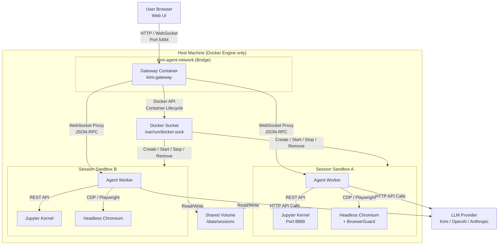
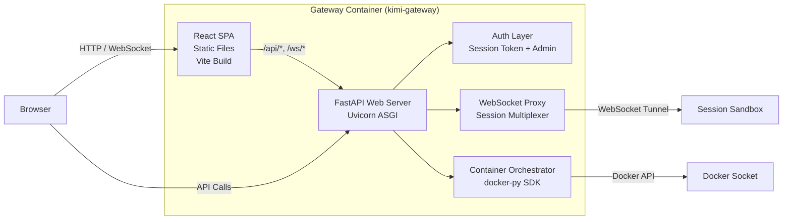
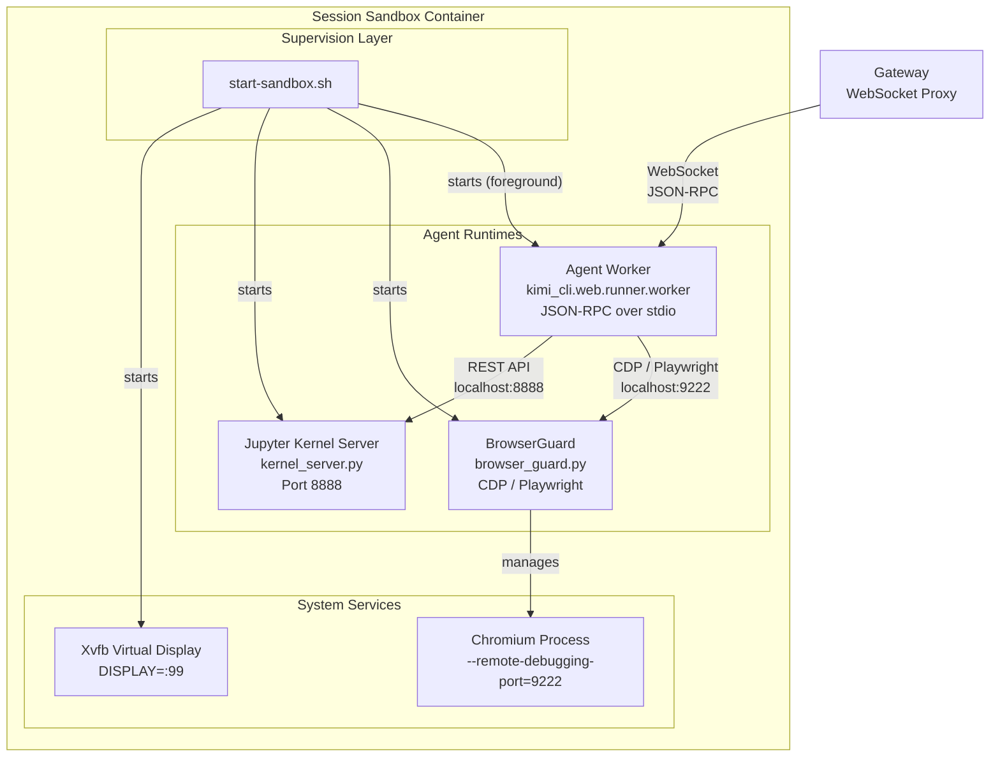
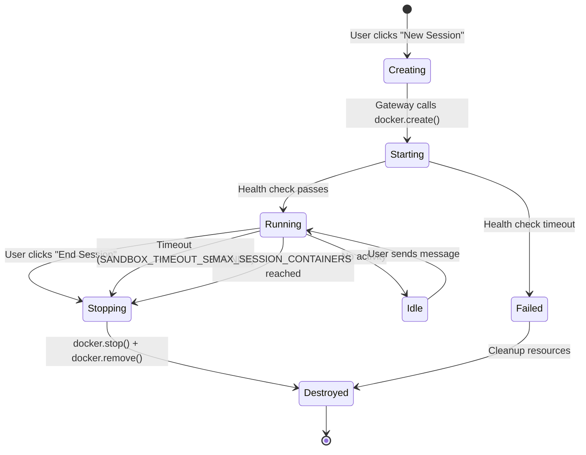

# OpenKimo Architecture

> **Slogan:** One Docker. Zero Worries.

This document provides a deep technical dive into OpenKimo's system architecture, component design, data flows, and the rationale behind key engineering decisions.

---

## Table of Contents

1. [System Overview](#system-overview)
2. [Gateway Component](#gateway-component)
3. [Sandbox Component](#sandbox-component)
4. [Data Flow](#data-flow)
5. [Session Lifecycle](#session-lifecycle)
6. [Design Decisions](#design-decisions)

---

## System Overview

OpenKimo is a **containerized server-side AI agent framework**. The core design principle is that every user session runs inside its own isolated Docker container. The host machine only needs Docker Engine installed — no Python, Node.js, or other build tools are required on the host.

### High-Level Architecture



### Component Roles

| Component | Responsibility | Container |
|-----------|---------------|-----------|
| **Gateway** | HTTP server, WebSocket proxy, container orchestration, user auth | `kimi-gateway` (1 instance) |
| **Session Sandbox** | Agent worker, Jupyter kernel, headless browser | One per session, dynamically created |
| **Docker Engine** | Container lifecycle management, cgroup resource enforcement | Host daemon |
| **Shared Volume** | Session persistence, user database, metadata | Host bind-mount |

---

## Gateway Component

The Gateway is the single entry point for all user traffic. It is built as a multi-stage Docker image combining a Python FastAPI backend with a React/Vite frontend.

### Gateway Internal Architecture



### 1. FastAPI Web Server

- **Entry Point:** `uvicorn kimi_cli.web.app:create_app --factory`
- **Responsibilities:**
  - Serve the React frontend static files
  - Expose RESTful APIs for session management, admin operations, and health checks
  - Handle WebSocket upgrade requests and route them to the appropriate session sandbox
  - Health check endpoint at `/healthz` (used by Docker healthcheck)

### 2. WebSocket Proxy

- Each user session establishes a persistent WebSocket connection to the Gateway
- The Gateway maintains a **per-session WebSocket tunnel** to the Agent Worker running inside the sandbox container
- All agent messages (user prompts, tool outputs, streaming responses) flow through this bidirectional pipe
- The proxy handles connection lifecycle: reconnections, backpressure, and graceful cleanup when a session ends

### 3. Container Orchestrator

- Uses the official `docker` Python SDK (`docker-py>=7.0.0`)
- Communicates with the host Docker Engine via the mounted `/var/run/docker.sock`
- Responsibilities:
  - **Create:** Spawn a new sandbox container from the `kimi-agent-sandbox` image with session-specific environment variables and resource limits
  - **Start:** Start the container and verify health via the Jupyter Kernel health endpoint (`/health`)
  - **Monitor:** Track container state, enforce the `MAX_SESSION_CONTAINERS` limit
  - **Destroy:** Stop and remove the container when the session ends or times out (`SANDBOX_TIMEOUT_SECONDS`)

### 4. User Authentication

- **Session Token:** `KIMI_WEB_SESSION_TOKEN` enables bearer-token authentication. If set, users must append `?token=<token>` to the URL
- **Admin Account:** Default admin credentials (`admin` / `admin123`) for the admin panel at `/admin`. Password should be changed immediately after first login
- **CORS & Origin:** Configurable via `KIMI_WEB_ALLOWED_ORIGINS` and `KIMI_WEB_ENFORCE_ORIGIN`
- **LAN-only mode:** `KIMI_WEB_LAN_ONLY` restricts access to private IP ranges

---

## Sandbox Component

Each session sandbox is an isolated Docker container that contains the full agent runtime environment. The sandbox image is built from `Dockerfile.sandbox` and includes Python 3.12, Chromium, Playwright, Jupyter, and all agent dependencies.

### Sandbox Internal Architecture



### 1. Agent Worker

- **Command:** `python -m kimi_cli.web.runner.worker <session_id>`
- **Communication:** Receives JSON-RPC messages over stdin/stdout, which are piped through the Gateway's WebSocket proxy
- **Responsibilities:**
  - Maintain the agent conversation loop
  - Parse user prompts and orchestrate tool calls (Shell, Python, Browser)
  - Stream LLM responses back to the user in real time
  - Manage session state and context window

### 2. Jupyter Kernel

- **Server:** `kernel_server.py` (FastAPI on port 8888)
- **Kernel:** `jupyter_kernel.py` (IPython kernel via `ipykernel` and `jupyter-client`)
- **Responsibilities:**
  - Execute Python code in an isolated kernel process
  - Support kernel reset (`POST /kernel/reset`) to clear variables and state
  - Support kernel interrupt (`POST /kernel/interrupt`) to stop long-running computations
  - Provide connection info for the worker to attach via Jupyter protocol
- **Isolation:** The kernel runs as a separate subprocess; crashing the kernel does not affect the agent worker

### 3. Headless Chromium + BrowserGuard

- **Browser:** Chromium with Playwright automation
- **Display:** Xvfb virtual framebuffer (`DISPLAY=:99`, `1920x1080x24`)
- **BrowserGuard:** Two implementations:
  - **Playwright mode** (default): `BrowserGuard` class manages a persistent browser context via Playwright, auto-recovers from crashes, monitors tab state
  - **CDP mode** (`USE_CDP=true`): `BrowserCDPGuard` uses raw Chrome DevTools Protocol for lower-level control
- **Capabilities:**
  - Web scraping, screenshots, DOM extraction
  - Form filling, click automation, infinite scroll handling
  - PDF rendering (with bundled PDF viewer extension)
- **Security flags:** `--no-sandbox` is required inside the container (already namespaced by Docker), `--disable-dev-shm-usage`, `--disable-blink-features=AutomationControlled`

### 4. Resource Limits

Every sandbox container is created with Docker runtime constraints:

| Limit | Default | Docker Flag |
|-------|---------|-------------|
| CPU | 2 cores | `--cpus=2` |
| Memory | 4 GB | `--memory=4g` |
| Disk | 10 GB | `--storage-opt size=10g` |
| PIDs | 1000 | `--pids-limit=1000` |
| Timeout | 24 hours | `--stop-timeout=86400` |
| Privileged | false | `--privileged=false` |

These limits are enforced by the host kernel via **cgroups v1/v2**.

---

## Data Flow

This section traces a complete user request from the browser to the LLM and back.

### Request Flow Sequence

```mermaid
sequenceDiagram
    autonumber
    actor User as User Browser
    participant GW as Gateway (FastAPI)
    participant orch as Container Orchestrator
    participant Docker as Docker Engine
    participant Box as Session Sandbox
    participant Worker as Agent Worker
    participant Jupyter as Jupyter Kernel
    participant Browser as BrowserGuard
    participant LLM as LLM Provider

    Note over User,LLM: Phase 1: Session Creation
    User->>GW: POST /api/sessions (create session)
    GW->>orch: spawn_sandbox(session_id)
    orch->>Docker: docker.containers.create(image, limits, env)
    Docker-->>orch: container object
    orch->>Docker: container.start()
    Docker->>Box: Start container
    Box->>Box: start-sandbox.sh runs
    Box->>Box: Start Xvfb, Jupyter, BrowserGuard
    Box->>Worker: Start Agent Worker (foreground)
    Worker->>GW: WebSocket connect (stdin/stdout pipe)
    GW-->>User: Session created + WebSocket URL

    Note over User,LLM: Phase 2: User Prompt
    User->>GW: WebSocket: {type: "prompt", text: "..."}
    GW->>Worker: Proxy message over WS tunnel
    Worker->>LLM: HTTP POST /v1/chat/completions
    LLM-->>Worker: Streaming response (SSE)
    
    alt Tool Call: Python
        Worker->>Jupyter: POST /execute (via REST)
        Jupyter-->>Worker: Execution result
        Worker->>LLM: Append result to conversation
    else Tool Call: Browser
        Worker->>Browser: Playwright / CDP command
        Browser-->>Worker: Screenshot / DOM / Action result
        Worker->>LLM: Append result to conversation
    else Tool Call: Shell
        Worker->>Box: subprocess.run(cmd)
        Box-->>Worker: stdout / stderr
        Worker->>LLM: Append result to conversation
    end
    
    LLM-->>Worker: Final response chunk
    Worker->>GW: WebSocket: {type: "response", text: "..."}
    GW->>User: Proxy to browser

    Note over User,LLM: Phase 3: Session End
    User->>GW: POST /api/sessions/{id}/close
    GW->>orch: destroy_sandbox(session_id)
    orch->>Docker: container.stop() + container.remove()
    Docker->>Box: SIGTERM → SIGKILL → cleanup
    Box-->>Docker: Container exited
    Docker-->>orch: Removal confirmed
    orch-->>GW: Cleanup complete
    GW-->>User: Session closed
```

### Data Flow Summary

| Step | Direction | Protocol | Data |
|------|-----------|----------|------|
| 1 | Browser → Gateway | HTTP POST | Session creation request |
| 2 | Gateway → Docker | Docker API | Container create/start |
| 3 | Browser → Gateway | WebSocket | User prompt, commands |
| 4 | Gateway → Worker | WebSocket (proxied) | JSON-RPC messages |
| 5 | Worker → LLM | HTTPS (REST/SSE) | Chat completions |
| 6 | Worker → Jupyter | HTTP REST | Code execution |
| 7 | Worker → Browser | Playwright/CDP | Browser automation |
| 8 | Worker → Sandbox OS | Local subprocess | Shell commands |
| 9 | Worker → Gateway | WebSocket (proxied) | Streaming response |
| 10 | Gateway → Browser | WebSocket | Real-time UI updates |

---

## Session Lifecycle

A session progresses through well-defined states from creation to destruction.

### State Machine



### Lifecycle Phases

#### 1. Creation

- User clicks "New Session" in the Web UI
- Gateway's Container Orchestrator validates `MAX_SESSION_CONTAINERS`
- A new sandbox container is created with:
  - Unique `KIMI_SESSION_ID`
  - Session-specific volume mount (`/data/sessions/<session_id>`)
  - Resource limits from environment variables
  - Network attachment to `kimi-agent-network`
- Gateway waits for the Jupyter Kernel health endpoint (`GET /health`) to return 200

#### 2. Running

- The Agent Worker starts and connects to the Gateway's WebSocket proxy
- User prompts flow through the WebSocket tunnel
- Tool execution happens inside the sandbox:
  - **Shell:** Direct subprocess execution (blocked if `BLOCK_DANGEROUS_COMMANDS=true`)
  - **Python:** Jupyter Kernel via REST API
  - **Browser:** BrowserGuard via Playwright/CDP
- LLM API calls are made from the sandbox container, not the host

#### 3. Idle & Timeout

- If no messages are exchanged for `SANDBOX_TIMEOUT_SECONDS` (default: 86400 = 24h), the Gateway automatically stops and removes the container
- This prevents resource leakage from abandoned sessions

#### 4. Destruction

- Triggered by: user action, timeout, or admin intervention
- Gateway sends `docker stop` (SIGTERM, grace period 10s) followed by `docker remove`
- Container filesystem is discarded (overlayfs layers are deleted)
- Session metadata and chat history persist in the shared volume (`/data/sessions`)

---

## Design Decisions

### Why One Container Per Session?

| Aspect | One Container Per Session | Shared Container |
|--------|--------------------------|------------------|
| **Isolation** | Complete process, filesystem, and network isolation | Shared kernel, risk of cross-session data leakage |
| **Resource Accounting** | Per-container cgroup limits (CPU, memory, PIDs) | Complex internal accounting required |
| **Fault Tolerance** | Crash of one session does not affect others | Single crash kills all sessions |
| **Cleanup** | `docker rm` instantly frees all resources | Requires careful garbage collection of internal state |
| **Overhead** | ~100-300 MB base + per-container overhead | Lower base overhead |

**Verdict:** The isolation and fault-tolerance benefits far outweigh the modest container overhead. For a server-side agent framework that executes arbitrary user code, strong isolation is non-negotiable.

### Why Mount the Docker Socket?

The Gateway container mounts `/var/run/docker.sock` to create and manage session sandbox containers. This is a well-established pattern (often called "Docker-out-of-Docker" or "DooD") with clear trade-offs:

**Alternatives Considered:**

| Approach | Pros | Cons |
|----------|------|------|
| **Docker Socket Mount (Chosen)** | Simple, no additional daemon, full Docker API access | Gateway container has Docker-level access to the host |
| **Docker-in-Docker (DinD)** | Complete isolation of Docker daemon | Requires privileged mode, double overlayfs, high overhead |
| **Remote Docker API (TLS)** | Network-level separation | Complex certificate management, latency |
| **Containerd / CRI** | Lower-level, more control | Significant refactoring, less mature Python SDK |

**Mitigations:**
- The Gateway image runs as **non-root** where possible
- The Docker socket is mounted **read-write** (required for container creation), but the Gateway only uses the `docker-py` SDK with least-privilege operations
- If the Gateway container is compromised, the attacker gains Docker-level access. This is why authentication and network restrictions on the Gateway are critical.

### Why FastAPI + Uvicorn?

| Aspect | FastAPI + Uvicorn | Flask + WSGI | Node.js + Express |
|--------|------------------|--------------|-------------------|
| **Async Native** | Yes (ASGI) | No (WSGI sync) | Yes |
| **WebSocket Support** | Built-in | Requires extensions | Built-in |
| **Python Ecosystem** | Native to agent codebase | Native | Requires bridging |
| **Type Safety** | Pydantic validation | Manual | TypeScript |
| **Performance** | High (asyncio + uvloop) | Moderate | High |

**Verdict:** FastAPI was chosen because the entire agent stack is Python-based. Using a Python-native async framework eliminates language boundary friction, enables shared data models (Pydantic), and provides first-class WebSocket support for the session proxy.

### Why Jupyter Kernel Instead of Raw `exec()`?

The sandbox uses a full Jupyter Kernel (`ipykernel`) for Python execution rather than simple `python -c` or `exec()`:

| Feature | Jupyter Kernel | Raw `exec()` |
|---------|---------------|--------------|
| **State Persistence** | Variables survive across calls | Stateless |
| **Interruptibility** | `POST /kernel/interrupt` stops runaway code | Uninterruptible once started |
| **Reset Capability** | `POST /kernel/reset` clears all state | N/A |
| **Rich Output** | Supports images, plots, HTML | Text only |
| **Isolation** | Runs in separate subprocess | Runs in worker process |

**Verdict:** Jupyter provides a production-grade Python execution environment with state management, interruption, and rich output — essential for an interactive agent framework.

---

*Document version: 1.0 | Last updated: 2026-04-27*
