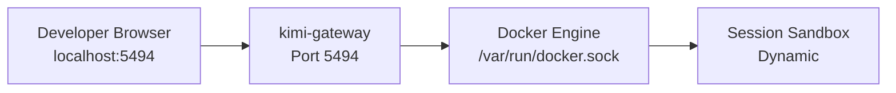
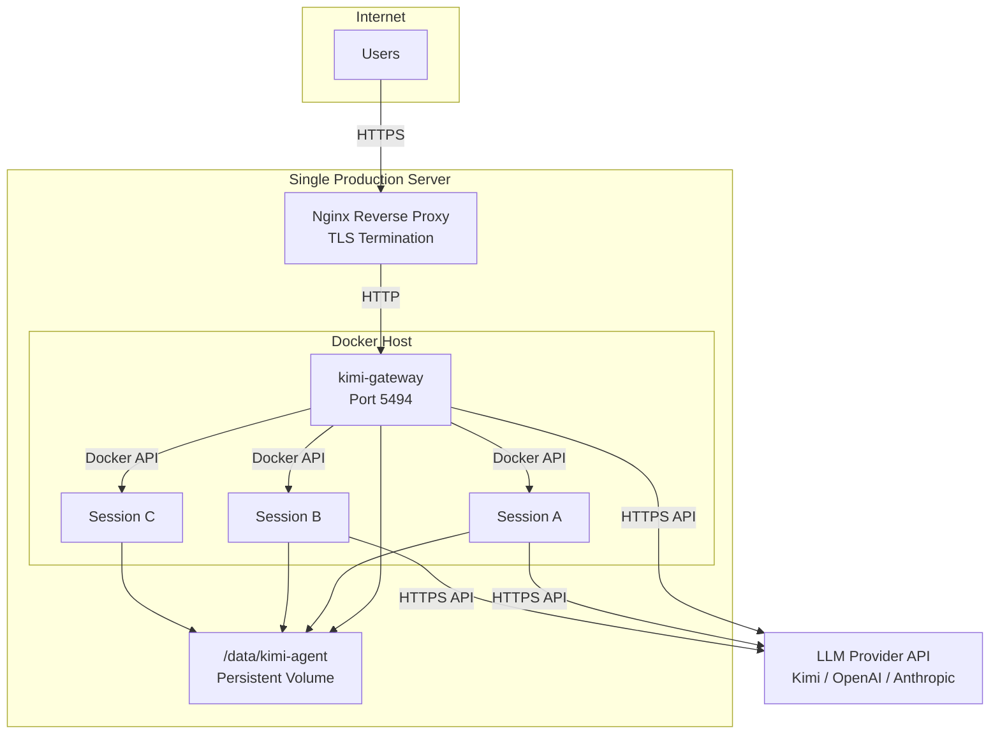

# OpenKimo Deployment Guide

This guide covers everything from local development deployment to production-grade single-node setups.

---

## Table of Contents

1. [Quick Deployment (Development)](#quick-deployment-development)
2. [Production Deployment Recommendations](#production-deployment-recommendations)
3. [Single-Node Deployment](#single-node-deployment)
4. [Resource Planning](#resource-planning)
5. [Update & Upgrade Workflow](#update--upgrade-workflow)
6. [Troubleshooting](#troubleshooting)

---

## Quick Deployment (Development)

The fastest way to get OpenKimo running locally for development or testing.

### Prerequisites

- [Docker Engine](https://docs.docker.com/get-docker/) 24.0+
- [Docker Compose](https://docs.docker.com/compose/install/) v2.0+
- At least one LLM API key (Kimi, OpenAI, or Anthropic)

### Step-by-Step

```bash
# 1. Clone the repository
git clone --recurse-submodules git@github.com:j0x7c4/OpenKimo.git
cd OpenKimo

# 2. Configure environment
cp .env.example .env
# Edit .env and set at least one LLM API key and KIMI_WEB_SESSION_TOKEN

# 3. Build images
docker-compose build

# 4. Start the stack
docker-compose up -d

# 5. Verify
docker-compose ps
docker logs -f kimi-gateway

# 6. Access Web UI
open http://localhost:5494
```

### Development `.env` (Minimal)

```bash
KIMI_API_KEY=sk-your-key-here
KIMI_WEB_SESSION_TOKEN=dev-token-change-in-production
KIMI_WEB_PORT=5494
LLM_PROVIDER=kimi
SANDBOX_MEMORY_LIMIT=2g
SANDBOX_CPU_LIMIT=1
```

### Architecture (Development)



---

## Production Deployment Recommendations

### 1. Reverse Proxy Configuration

Never expose the Gateway container directly to the public internet in production. Use a reverse proxy for TLS termination, rate limiting, and static asset caching.

#### Nginx

```nginx
# /etc/nginx/sites-available/openkimo
upstream openkimo_backend {
    server localhost:5494;
    keepalive 32;
}

server {
    listen 80;
    server_name openkimo.example.com;
    return 301 https://$server_name$request_uri;
}

server {
    listen 443 ssl http2;
    server_name openkimo.example.com;

    ssl_certificate /etc/letsencrypt/live/openkimo.example.com/fullchain.pem;
    ssl_certificate_key /etc/letsencrypt/live/openkimo.example.com/privkey.pem;
    ssl_protocols TLSv1.2 TLSv1.3;
    ssl_ciphers ECDHE-ECDSA-A128GCM-SHA256:ECDHE-RSA-A128GCM-SHA256;
    ssl_prefer_server_ciphers off;

    # Security headers
    add_header X-Frame-Options "SAMEORIGIN" always;
    add_header X-Content-Type-Options "nosniff" always;
    add_header X-XSS-Protection "1; mode=block" always;
    add_header Referrer-Policy "strict-origin-when-cross-origin" always;

    # WebSocket support
    location /ws {
        proxy_pass http://openkimo_backend;
        proxy_http_version 1.1;
        proxy_set_header Upgrade $http_upgrade;
        proxy_set_header Connection "upgrade";
        proxy_set_header Host $host;
        proxy_set_header X-Real-IP $remote_addr;
        proxy_set_header X-Forwarded-For $proxy_add_x_forwarded_for;
        proxy_set_header X-Forwarded-Proto $scheme;
        proxy_read_timeout 86400;
    }

    # Static assets (optional caching)
    location /static {
        proxy_pass http://openkimo_backend;
        proxy_cache_valid 200 1h;
        add_header Cache-Control "public, max-age=3600";
    }

    # API and frontend
    location / {
        proxy_pass http://openkimo_backend;
        proxy_set_header Host $host;
        proxy_set_header X-Real-IP $remote_addr;
        proxy_set_header X-Forwarded-For $proxy_add_x_forwarded_for;
        proxy_set_header X-Forwarded-Proto $scheme;
        proxy_buffering off;
    }
}
```

#### Caddy (Simpler Alternative)

```caddyfile
# /etc/caddy/Caddyfile
openkimo.example.com {
    reverse_proxy localhost:5494
    
    # Automatic HTTPS via Let's Encrypt
    # WebSocket is handled transparently
    
    header {
        X-Frame-Options SAMEORIGIN
        X-Content-Type-Options nosniff
        Referrer-Policy strict-origin-when-cross-origin
    }
}
```

### 2. HTTPS Configuration

**Required for production.** The Web UI and API endpoints must be served over TLS to protect:
- LLM API keys (transmitted in headers)
- Session tokens
- User prompts and agent responses

**Recommended:** Use [Let's Encrypt](https://letsencrypt.org/) with certbot or Caddy's automatic HTTPS.

```bash
# Certbot (with Nginx)
sudo certbot --nginx -d openkimo.example.com

# Auto-renewal test
sudo certbot renew --dry-run
```

### 3. Environment Variable Security

**Never commit `.env` to Git.** The `.env` file contains sensitive API keys and tokens.

```bash
# Verify .env is ignored
cat .gitignore | grep -E "^\.env"

# If not, add it
echo ".env" >> .gitignore
```

**Production secrets management options:**

| Method | Security | Complexity | Best For |
|--------|----------|------------|----------|
| `.env` file with `600` permissions | Low | Simple | Single server, trusted admin |
| Docker Secrets | Medium | Low | Docker Swarm |
| HashiCorp Vault | High | High | Multi-team, compliance |
| AWS Secrets Manager / GCP Secret Manager | High | Medium | Cloud deployments |
| systemd credential passing | Medium | Medium | Linux bare-metal |

**Minimum production `.env` hardening:**

```bash
# Set restrictive permissions
chmod 600 .env
chown root:root .env

# Generate a strong session token
openssl rand -hex 32
```

### 4. Persistent Data Directory Configuration

Session data (chat history, user database, metadata) is stored in a shared volume mounted at `/data/sessions` inside the Gateway container.

**Production recommendation:** Use an absolute path on a dedicated disk or partition.

```yaml
# docker-compose.yml (production override)
version: "3.9"
services:
  gateway:
    volumes:
      - /var/run/docker.sock:/var/run/docker.sock
      - /data/kimi-agent/sessions:/data/sessions  # Dedicated disk
      - /data/kimi-agent/plugins:/app/src/kimi_cli/web/static/plugins
```

**Backup strategy:**

```bash
# Daily backup cron job
0 2 * * * /usr/bin/rsync -a /data/kimi-agent/sessions/ /backup/kimi-agent/sessions-$(date +\%Y\%m\%d)/

# Retention: keep 7 days
find /backup/kimi-agent/ -maxdepth 1 -type d -mtime +7 -exec rm -rf {} \;
```

### 5. Log Management

The Gateway and sandboxes generate logs in several locations:

| Source | Location | Collection Method |
|--------|----------|-------------------|
| Gateway stdout/stderr | `docker logs kimi-gateway` | Docker logging driver |
| Sandbox stdout/stderr | `docker logs <container_id>` | Docker logging driver |
| BrowserGuard | `/app/logs/browser_guard.log` (inside sandbox) | Mount logs volume |
| Jupyter Kernel | `/app/logs/kernel_server.log` (inside sandbox) | Mount logs volume |
| Chromium | `/app/logs/chromium.log` (inside sandbox) | Mount logs volume |

**Production log configuration:**

```yaml
# docker-compose.yml
services:
  gateway:
    logging:
      driver: "json-file"
      options:
        max-size: "100m"
        max-file: "5"
    volumes:
      - /var/log/kimi-agent:/app/logs  # Optional: gateway logs
```

**Centralized logging (optional):**

```yaml
# Send to journald or syslog
logging:
  driver: journald
  options:
    tag: "kimi-gateway"
```

---

## Single-Node Deployment

For small-to-medium teams (up to ~50 concurrent sessions), a single well-provisioned server is sufficient.

### Recommended Server Specs

| Concurrent Sessions | CPU | Memory | Disk | Network |
|---------------------|-----|--------|------|---------|
| 5 | 8 cores | 32 GB | 200 GB SSD | 100 Mbps |
| 20 | 16 cores | 64 GB | 500 GB SSD | 500 Mbps |
| 50 | 32 cores | 128 GB | 1 TB SSD | 1 Gbps |

### OS Hardening

```bash
# 1. Keep Docker updated
sudo apt update && sudo apt upgrade -y

# 2. Enable Docker live-restore (keeps sandboxes running during daemon restart)
echo '{"live-restore": true}' | sudo tee /etc/docker/daemon.json
sudo systemctl restart docker

# 3. Restrict Docker socket access
sudo usermod -aG docker <deploy-user>
# Never run as root unless necessary

# 4. Firewall rules
sudo ufw default deny incoming
sudo ufw allow 22/tcp      # SSH
sudo ufw allow 80/tcp      # HTTP (redirects to HTTPS)
sudo ufw allow 443/tcp     # HTTPS
sudo ufw allow from 10.0.0.0/8 to any port 5494  # Internal LAN only (if LAN-only mode)
sudo ufw enable

# 5. Automatic security updates
sudo apt install unattended-upgrades
sudo dpkg-reconfigure unattended-upgrades
```

### Deployment Architecture



### Docker Compose (Production)

```yaml
version: "3.9"

services:
  gateway:
    image: kimi-agent-gateway:latest
    container_name: kimi-gateway
    restart: unless-stopped
    ports:
      - "127.0.0.1:5494:5494"  # Bind to localhost only; Nginx handles external traffic
    volumes:
      - /var/run/docker.sock:/var/run/docker.sock
      - /data/kimi-agent/sessions:/data/sessions
      - /data/kimi-agent/plugins:/app/src/kimi_cli/web/static/plugins
      - /data/kimi-agent/logs:/app/logs
    environment:
      - KIMI_API_KEY=${KIMI_API_KEY}
      - OPENAI_API_KEY=${OPENAI_API_KEY}
      - ANTHROPIC_API_KEY=${ANTHROPIC_API_KEY}
      - LLM_PROVIDER=${LLM_PROVIDER:-kimi}
      - KIMI_WEB_SESSION_TOKEN=${KIMI_WEB_SESSION_TOKEN}
      - KIMI_WEB_PORT=5494
      - KIMI_WEB_ENFORCE_ORIGIN=true
      - KIMI_WEB_RESTRICT_SENSITIVE_APIS=true
      - KIMI_WEB_LAN_ONLY=false
      - MAX_SESSION_CONTAINERS=${MAX_SESSION_CONTAINERS:-50}
      - SANDBOX_CPU_LIMIT=${SANDBOX_CPU_LIMIT:-2}
      - SANDBOX_MEMORY_LIMIT=${SANDBOX_MEMORY_LIMIT:-4g}
      - SANDBOX_DISK_LIMIT=${SANDBOX_DISK_LIMIT:-10g}
      - SANDBOX_TIMEOUT_SECONDS=${SANDBOX_TIMEOUT_SECONDS:-86400}
      - BLOCK_DANGEROUS_COMMANDS=true
    networks:
      - kimi-agent-network
    healthcheck:
      test: ["CMD", "python", "-c", "import urllib.request; urllib.request.urlopen('http://localhost:5494/healthz')"]
      interval: 30s
      timeout: 10s
      retries: 3
      start_period: 40s
    deploy:
      resources:
        limits:
          cpus: '4'
          memory: 8G
        reservations:
          cpus: '2'
          memory: 4G

networks:
  kimi-agent-network:
    driver: bridge
    name: kimi-agent-network
```

---

## Resource Planning

### Per-Session Resource Footprint

| Component | CPU | Memory | Disk | Notes |
|-----------|-----|--------|------|-------|
| Base sandbox idle | ~0.1 cores | ~800 MB | ~500 MB | Worker + kernel + browser |
| Active shell/Python | ~0.5 cores | +200 MB | minimal | Depends on workload |
| Active browser | ~0.3 cores | +400 MB | ~100 MB | Chromium + page content |
| LLM inference wait | ~0.05 cores | baseline | minimal | Mostly I/O wait |
| **Typical active session** | **~1 core** | **~1.5 GB** | **~1 GB** | Average mixed workload |
| **Peak session** | **~2 cores** | **~4 GB** | **~10 GB** | Heavy browser + ML load |

### Capacity Formula

```
Required CPU Cores  = Concurrent_Sessions × SANDBOX_CPU_LIMIT × 0.7
Required Memory     = Concurrent_Sessions × SANDBOX_MEMORY_LIMIT × 0.8
Required Disk       = Concurrent_Sessions × SANDBOX_DISK_LIMIT + Gateway_Overhead

# Example: 20 concurrent sessions, default limits
CPU  = 20 × 2 × 0.7  = 28 cores  → 32-core server recommended
RAM  = 20 × 4g × 0.8 = 64 GB    → 64 GB server recommended
Disk = 20 × 10g + 50g = 250 GB  → 500 GB SSD recommended
```

The `0.7` and `0.8` factors account for the fact that not all sessions are CPU-bound or memory-bound simultaneously.

### Scaling Headroom

Always reserve **20% headroom** on CPU and memory for:
- Docker Engine overhead
- Image pull and build operations
- Kernel page cache
- Spikes in session activity

---

## Update & Upgrade Workflow

### Zero-Downtime Image Update

OpenKimo does not currently support rolling updates for the Gateway (it is a single instance). Plan maintenance windows for Gateway updates. Sandbox containers can be left running during Gateway updates if Docker live-restore is enabled.

```bash
# 1. Announce maintenance window
# 2. Pull latest code
git pull origin main
git submodule update --init --recursive

# 3. Rebuild images
docker-compose build

# 4. Graceful stop (allow active sessions to finish)
docker-compose stop -t 60

# 5. Start new version
docker-compose up -d

# 6. Verify health
docker-compose ps
curl -f http://localhost:5494/healthz || echo "Health check failed"
```

### Rolling Sandbox Image Update

If you update the sandbox image, existing sessions continue running on the old image. New sessions will use the updated image.

```bash
# Update sandbox image only
docker-compose build --no-cache gateway   # if gateway code changed
docker-compose build --no-cache sandbox   # if sandbox code changed

# Rolling restart of existing sessions (optional)
# This requires users to re-create sessions
docker ps -q --filter "label=openkimo.session" | xargs docker stop
```

### Database Migration (if applicable)

Session data is stored in SQLite (`users.db`) and JSON files. There is currently no schema migration tool. Backup before any update that modifies the data format.

```bash
# Pre-update backup
cp -r /data/kimi-agent/sessions /backup/sessions-pre-$(date +%Y%m%d)
```

---

## Troubleshooting

### Common Issues

#### Gateway fails to start: "No LLM API key configured"

```
WARNING: No LLM API key configured.
```

**Fix:** Set at least one of `KIMI_API_KEY`, `OPENAI_API_KEY`, or `ANTHROPIC_API_KEY` in `.env`, then restart:

```bash
docker-compose down
docker-compose up -d
```

#### Sandbox containers fail to start

```
Error: No such image: kimi-agent-sandbox:latest
```

**Fix:** Build the sandbox image:

```bash
docker-compose build
# Or individually:
docker build -f Dockerfile.sandbox -t kimi-agent-sandbox:latest .
```

#### Permission denied on Docker socket

```
docker.errors.DockerException: Error while fetching server API version: Permission denied
```

**Fix:** The user running inside the Gateway container needs access to the Docker socket. On the host:

```bash
# Verify socket permissions
ls -la /var/run/docker.sock

# If needed, add the deploy user to the docker group
sudo usermod -aG docker $USER
# Log out and back in for group changes to take effect
```

#### Session timeout / WebSocket disconnects

**Symptoms:** Agent stops responding; browser shows "Disconnected"

**Diagnosis:**

```bash
# Check Gateway logs
docker logs --tail 100 kimi-gateway

# Check if sandbox is still running
docker ps --filter "label=openkimo.session"

# Check sandbox health
docker exec <sandbox-id> python -c "import urllib.request; urllib.request.urlopen('http://localhost:8888/health')"
```

**Common causes:**
- **Nginx proxy timeout:** Increase `proxy_read_timeout` for the `/ws` location
- **Sandbox OOM:** Increase `SANDBOX_MEMORY_LIMIT`; check `dmesg | grep -i kill`
- **Sandbox CPU throttling:** Heavy computation causes health check timeouts; increase `SANDBOX_CPU_LIMIT`

#### Browser automation fails

**Symptoms:** Agent reports "browser not available" or screenshots are blank

**Diagnosis:**

```bash
# Check BrowserGuard logs inside sandbox
docker exec <sandbox-id> cat /app/logs/browser_guard.log

# Check if Xvfb is running
docker exec <sandbox-id> pgrep -a Xvfb

# Check Chromium logs
docker exec <sandbox-id> cat /app/logs/chromium.log
```

**Fix:** Ensure `ENABLE_BROWSER=true` and the sandbox has sufficient memory (Chromium needs at least 1 GB).

#### High disk usage

**Diagnosis:**

```bash
# Check Docker disk usage
docker system df -v

# Check session data size
du -sh /data/kimi-agent/sessions/*

# Find large containers
docker ps -s
```

**Fix:**

```bash
# Prune unused images and build cache
docker system prune -a --volumes

# Clean up old session data (use with caution)
find /data/kimi-agent/sessions -maxdepth 1 -type d -mtime +30 -exec rm -rf {} \;
```

#### Cannot pull sandbox image on start

**Symptoms:** Gateway logs show "pull access denied" or "repository not found"

**Fix:** If using a private registry, ensure the host Docker daemon is authenticated:

```bash
docker login registry.example.com
# Then restart the Gateway so it inherits the credentials
docker-compose restart gateway
```

### Debug Commands Cheatsheet

```bash
# Gateway status
docker-compose ps
docker logs -f --tail 200 kimi-gateway

# List active sessions
docker ps --format "table {{.Names}}\t{{.Status}}\t{{.Size}}" --filter "label=openkimo.session"

# Inspect a sandbox
docker inspect <sandbox-container-id>

# Enter a running sandbox (for debugging only)
docker exec -it <sandbox-container-id> /bin/bash

# Resource usage of all sandboxes
docker stats --format "table {{.Name}}\t{{.CPUPerc}}\t{{.MemUsage}}\t{{.NetIO}}"

# Network connectivity from sandbox
docker exec <sandbox-id> curl -I https://api.moonshot.cn/v1

# Restart a specific service
docker-compose restart gateway
```

---

*Document version: 1.0 | Last updated: 2026-04-27*
