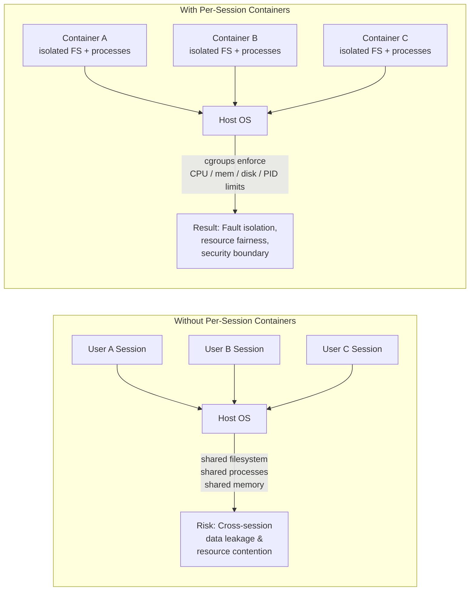
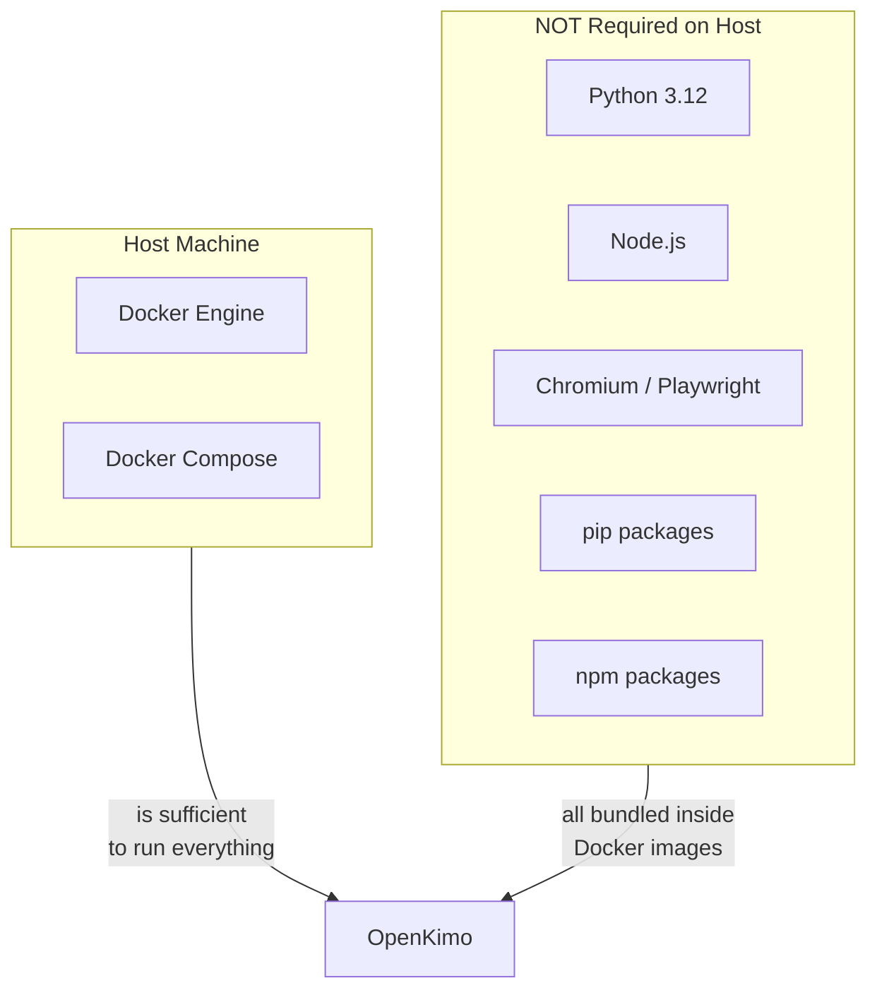
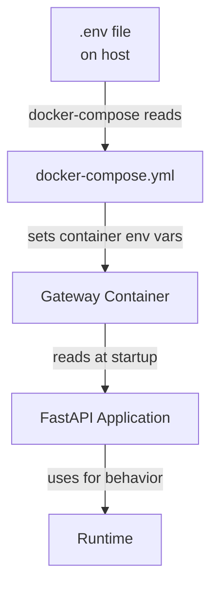
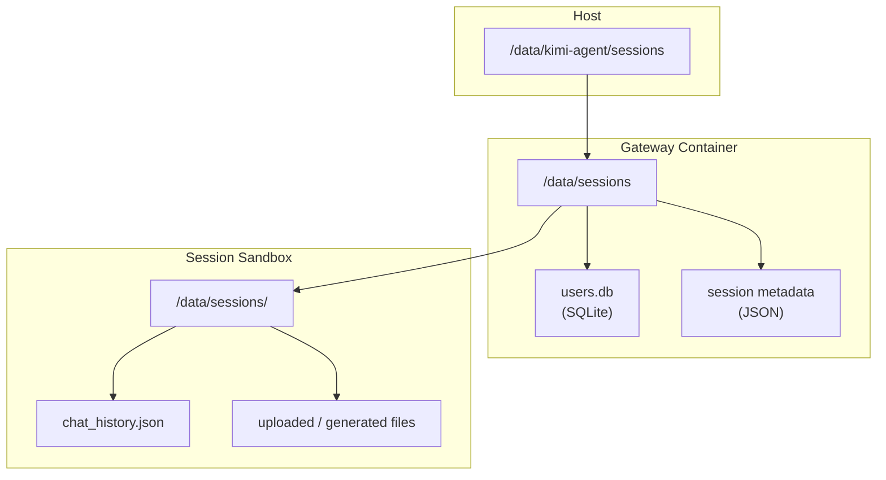
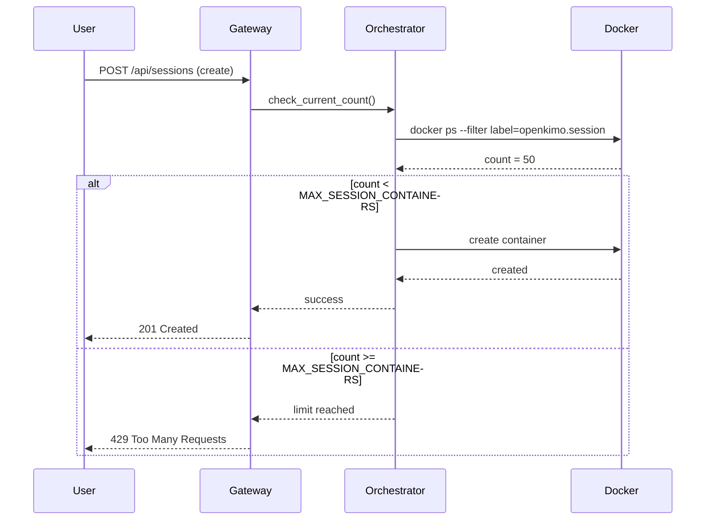
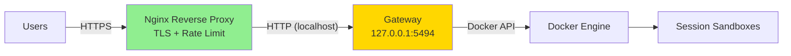
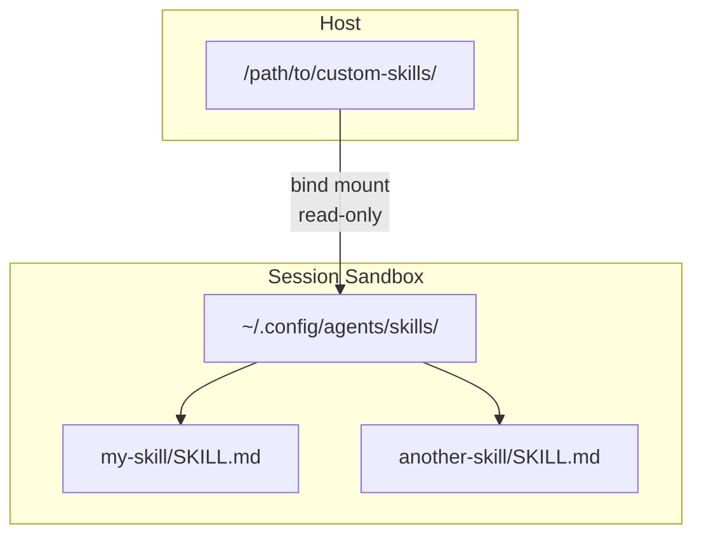

# OpenKimo Frequently Asked Questions

---

## 1. What is the difference between OpenKimo and OpenClaw?

**OpenKimo** and **OpenClaw** are both AI agent frameworks built on top of the `kimi-cli` core, but they target different deployment models:

| Aspect | OpenKimo | OpenClaw |
|--------|----------|----------|
| **Primary Use Case** | Server-side, multi-user deployment | Local CLI, single-user development |
| **Execution Model** | One Docker container per session | Runs directly on the host OS (default) |
| **Access Interface** | Web browser (React SPA) | Terminal / command line |
| **Host Requirements** | Docker Engine only | Python, Node.js, and all dependencies |
| **Session Isolation** | Strong (per-session containers) | None (default) or per-command sandbox |
| **Multi-User Support** | Built-in (session separation via containers) | Single-user by design |
| **Slogan** | One Docker. Zero Worries. | — |

Think of OpenClaw as the local development tool and OpenKimo as the server deployment wrapper that adds containerization, a Web UI, and multi-user isolation.

---

## 2. Why does each session need a Docker container?

OpenKimo's core security and operational model is **per-session containerization**. Here's why:



**Key benefits:**
- **Fault Isolation:** If one session crashes (infinite loop, OOM, segfault), others are unaffected
- **Security Boundary:** Session A cannot read Session B's files, environment variables, or memory
- **Resource Fairness:** Each session gets its own CPU, memory, and disk quota via cgroup limits
- **Clean Cleanup:** `docker rm` instantly destroys all session state — no garbage collection needed
- **Zero Host Pollution:** The host machine never installs Python packages, browser profiles, or temporary files from agent execution

The trade-off is ~100–300 MB of memory overhead per container. For server deployments, this is a reasonable cost for strong isolation.

---

## 3. What needs to be installed on the host machine?

**Only Docker Engine and Docker Compose.**



Everything else — Python runtime, Node.js, Chromium, PyTorch, Jupyter, Playwright, and all application code — is packaged inside the Gateway and Sandbox Docker images. This is intentional: it eliminates "works on my machine" problems and ensures consistent environments across development, staging, and production.

**Minimum host specs for development:**
- Docker 24.0+
- Docker Compose v2.0+
- 4 GB RAM, 2 CPU cores
- 20 GB free disk space

---

## 4. Which LLM providers are supported?

OpenKimo supports three major LLM providers out of the box:

| Provider | Environment Variable | Default Base URL | Supported Models |
|----------|---------------------|------------------|------------------|
| **Kimi / Moonshot** | `KIMI_API_KEY` | `https://api.moonshot.cn/v1` | `kimi-k2`, `kimi-k2.6`, etc. |
| **OpenAI** | `OPENAI_API_KEY` | `https://api.openai.com/v1` | `gpt-4o`, `gpt-4-turbo`, etc. |
| **Anthropic Claude** | `ANTHROPIC_API_KEY` | `https://api.anthropic.com` | `claude-3-5-sonnet`, etc. |

You must configure **at least one** API key in `.env`. You can configure multiple keys and switch between providers using the `LLM_PROVIDER` environment variable.

```bash
# Example: Use OpenAI
LLM_PROVIDER=openai
OPENAI_API_KEY=sk-...

# Example: Use Kimi
LLM_PROVIDER=kimi
KIMI_API_KEY=sk-...
```

OpenAI-compatible endpoints (e.g., local LLM servers, Azure OpenAI) can also be used by setting the corresponding `*_BASE_URL` variable.

---

## 5. How do I update the configuration?

All configuration is managed via the `.env` file and environment variables passed to the Gateway container.

### Update Workflow

```bash
# 1. Edit configuration
nano .env

# 2. Restart the Gateway to pick up changes
docker-compose down
docker-compose up -d

# 3. Verify the new configuration
docker logs --tail 20 kimi-gateway
```

### Configuration Hierarchy



**Important:** Changes to `.env` do **not** take effect until you restart the Gateway container. Running `docker-compose up -d` without `down` first may not update environment variables.

For sandbox-specific settings (like `SANDBOX_MEMORY_LIMIT`), existing running sessions are **not** affected. Only new sessions spawned after the restart will use the updated limits.

---

## 6. Is session data persisted?

**Yes, partially.** Session data is stored in a shared volume mounted at `/data/sessions` on the Gateway container.



### What is persisted?
- **User accounts and authentication** (`users.db`)
- **Session metadata** (creation time, owner, status)
- **Chat history and conversation logs**
- **Files uploaded or generated during the session** (in the session's subdirectory)

### What is NOT persisted?
- **Sandbox container filesystem** (`/tmp`, `/var`, installed packages, browser cache) — destroyed when the container is removed
- **Jupyter kernel variables** — lost on container destruction
- **Browser state** (cookies, localStorage, open tabs) — lost on container destruction
- **In-memory conversation state** — lost on container destruction

If you need to preserve files across sessions, download them from the Web UI or ensure they are saved to the session's data directory before the session ends.

---

## 7. How do I limit the number of concurrent sessions?

Use the `MAX_SESSION_CONTAINERS` environment variable.

```bash
# .env
MAX_SESSION_CONTAINERS=20
```

When the limit is reached, new session creation requests will be rejected with an HTTP 429 (Too Many Requests) or a similar error message in the Web UI.

### How it works



**Resource planning tip:** Set `MAX_SESSION_CONTAINERS` based on your host's capacity. See [DEPLOYMENT.md](DEPLOYMENT.md#resource-planning) for the capacity formula.

---

## 8. What should I watch out for in production deployments?

Production deployments require additional hardening beyond the default docker-compose setup:

### Checklist

| # | Item | Severity | How to Address |
|---|------|----------|----------------|
| 1 | **Change default admin password** | Critical | Log in to `/admin` and change from `admin123` |
| 2 | **Set `KIMI_WEB_SESSION_TOKEN`** | Critical | Generate with `openssl rand -hex 32` |
| 3 | **Use HTTPS / TLS** | Critical | Deploy behind Nginx or Caddy with valid certificates |
| 4 | **Do not expose port 5494 publicly** | Critical | Bind to `127.0.0.1:5494` or internal network only |
| 5 | **Restrict CORS origins** | High | Set `KIMI_WEB_ALLOWED_ORIGINS` to your domain |
| 6 | **Enable sensitive API restrictions** | High | Set `KIMI_WEB_RESTRICT_SENSITIVE_APIS=true` |
| 7 | **Set resource limits appropriately** | High | Tune `SANDBOX_*_LIMIT` for your host capacity |
| 8 | **Enable session timeout** | Medium | `SANDBOX_TIMEOUT_SECONDS` prevents resource leaks |
| 9 | **Monitor disk usage** | Medium | Set up log rotation and session data cleanup |
| 10 | **Keep Docker and images updated** | Medium | Regularly rebuild images for security patches |

### Production Architecture



See [DEPLOYMENT.md](DEPLOYMENT.md) for full production deployment instructions including Nginx/Caddy configuration examples.

---

## 9. How do I add custom Skills?

OpenKimo supports custom Skills through a host directory mount.

### Directory Structure

```
custom-skills/
├── my-skill/
│   ├── SKILL.md
│   └── scripts/
│       └── helper.py
└── another-skill/
    └── SKILL.md
```

Each skill is a subdirectory containing at minimum a `SKILL.md` file that describes the skill's triggers, behavior, and usage.

### Configuration

```bash
# .env
CUSTOM_SKILLS_HOST_PATH=/absolute/path/to/custom-skills
```

When set, this directory is mounted into every session sandbox at `~/.config/agents/skills/`, making the skills available to the agent worker.



### Steps to Add a Skill

1. Create a new directory under your custom skills path:
   ```bash
   mkdir -p /path/to/custom-skills/my-skill
   ```

2. Write the `SKILL.md` following the skill specification format (triggers, description, examples).

3. Restart OpenKimo:
   ```bash
   docker-compose down
   docker-compose up -d
   ```

4. New sessions will automatically load the skill.

**Note:** Custom skills are mounted read-only into sandboxes. They cannot be modified from within a session.

---

## 10. What should I do if I encounter Docker permission errors?

### Symptom

```
docker.errors.DockerException: Error while fetching server API version: Permission denied
```

or

```
Got permission denied while trying to connect to the Docker daemon socket at unix:///var/run/docker.sock
```

### Root Cause

The user running the Gateway container (or the Docker daemon socket on the host) does not have permission to access the Docker API.

### Solutions

#### Option A: Add user to `docker` group (Recommended for development)

```bash
# On the host machine
sudo usermod -aG docker $USER

# Log out and log back in (or reboot)
# Verify:
docker ps
```

#### Option B: Fix socket permissions (Not recommended for production)

```bash
# Make socket accessible to all users (security risk)
sudo chmod 666 /var/run/docker.sock

# Better: restrict to a specific group
sudo chown root:docker /var/run/docker.sock
sudo chmod 660 /var/run/docker.sock
```

#### Option C: Run docker-compose as root (Discouraged)

```bash
sudo docker-compose up -d
```

This works but increases risk. Avoid in production.

#### Option D: Rootless Docker (Advanced)

For production, consider [Rootless Docker](https://docs.docker.com/engine/security/rootless/) which runs the Docker daemon as an unprivileged user, reducing the impact of a Docker socket compromise.

### Verification

```bash
# Check socket ownership
ls -la /var/run/docker.sock
# Expected: srwxrwxrwx 1 root docker ...

# Check your groups
groups $USER
# Expected: ... docker ...

# Test Docker API access
docker info
```

---

## Additional Questions

### Can I run OpenKimo without Docker?

No. Docker is a fundamental requirement. OpenKimo's architecture relies on Docker for container orchestration, namespace isolation, and cgroup resource enforcement. Running without Docker would defeat the purpose of the framework.

### Does OpenKimo work on ARM64 (Apple Silicon, AWS Graviton)?

Yes, with caveats. The Dockerfiles include architecture detection for the Docker CLI download. However, some dependencies (particularly PyTorch and Chromium) may have limited or slower ARM64 support. Building the sandbox image on ARM64 will take significantly longer due to PyTorch compilation.

### How do I back up my data?

Back up the host directory mounted at `/data/sessions`:

```bash
# While OpenKimo is running (SQLite is safe to copy with WAL mode)
rsync -av /data/kimi-agent/sessions/ /backup/kimi-sessions-$(date +%Y%m%d)/

# Or use docker-compose stop for a clean snapshot
docker-compose stop
rsync -av /data/kimi-agent/sessions/ /backup/kimi-sessions/
docker-compose up -d
```

### Can I use a GPU inside the sandbox?

Not by default. The sandbox containers do not mount GPU devices or the NVIDIA runtime. If you need GPU access for ML workloads, you would need to:

1. Install the NVIDIA Container Toolkit on the host
2. Modify the Gateway's container orchestration code to pass `--gpus` flags
3. Rebuild the sandbox image with CUDA drivers

This is not officially supported but is technically possible.

### How do I debug a crashed session?

```bash
# Find the sandbox container ID
docker ps -a --filter "label=openkimo.session"

# Check logs
docker logs <container-id>

# Inspect exit code and state
docker inspect <container-id> --format '{{.State.ExitCode}} {{.State.Error}}'

# If OOM killed, check host dmesg
dmesg | grep -i "killed process"
```

---

*Document version: 1.0 | Last updated: 2026-04-27*
