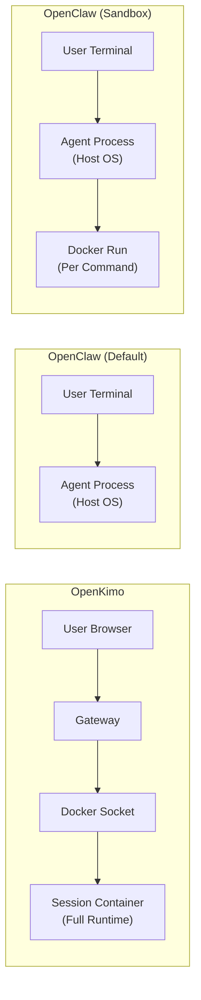
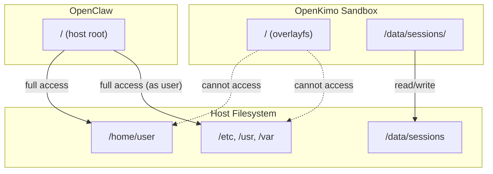
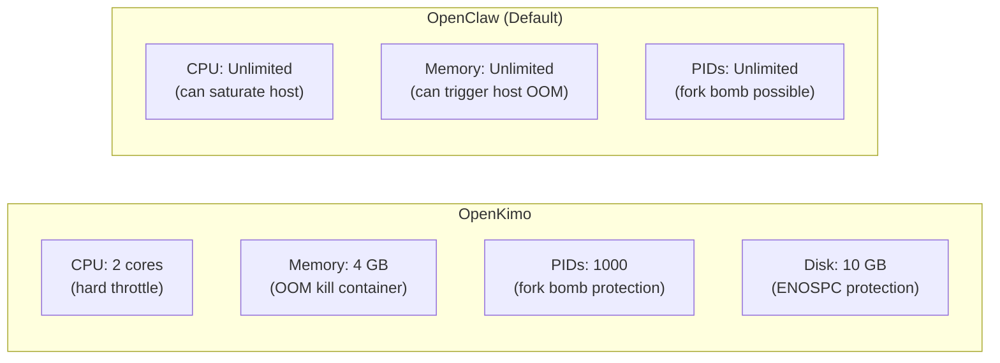

# Security Comparison: OpenKimo vs. Alternative Approaches

This document provides an objective, fact-based comparison of OpenKimo's security model against alternative AI agent execution environments. We do not claim superiority in all dimensions; different approaches suit different threat models and operational constraints.

---

## Comparison Table

| Dimension | **OpenKimo** | **OpenClaw (Default)** | **OpenClaw (Sandbox Mode)** | **Local CLI (e.g., raw kimi-cli)** | **Cloud Function / FaaS** |
|-----------|:-----------:|:----------------------:|:---------------------------:|:-----------------------------------:|:------------------------:|
| **Default Execution Environment** | Docker container (per session) | Host OS (user's machine) | Docker container (per operation) | Host OS (user's machine) | Ephemeral container (per invocation) |
| **Session Isolation** | Strong (full container per session) | None (shared host) | Moderate (container per shell command) | None (shared host) | Strong (fresh container per invocation) |
| **Host Filesystem Access** | No direct access; only shared volume | Full read/write access to user's home directory | Configurable (bind mounts) | Full read/write access | No access (ephemeral filesystem) |
| **Network Isolation** | Docker bridge network (NAT) | Host network | Docker bridge network (NAT) | Host network | Varies (often restricted egress) |
| **Privileged Mode** | `false` by default | N/A (runs as user process) | `false` by default | N/A | `false` (provider-managed) |
| **Resource Limits** | CPU, memory, disk, PID limits via cgroup | OS-level only (ulimit) | CPU, memory via Docker | OS-level only | Provider-enforced (time, memory) |
| **Dangerous Command Interception** | Pattern-based block list (`BLOCK_DANGEROUS_COMMANDS`) | User prompt confirmation | Pattern-based block list | None (full user discretion) | Often blocked by restricted shell |
| **Process Persistence** | Session container runs until timeout or user ends it | Agent process exits when task completes | Temporary container per command | Agent process exits when task completes | Cold start per invocation; max execution time |
| **Multi-User Safety** | Designed for multi-user server deployment | Single-user by design | Single-user by design | Single-user by design | Multi-tenant by provider design |
| **Operational Complexity** | Medium (requires Docker host) | Low (pip install and run) | Medium (requires Docker locally) | Low | Low (managed service) |
| **LLM API Key Storage** | Centralized in Gateway env var | User's local env / config file | User's local env / config file | User's local env / config file | Managed by platform or user |

---

## Detailed Analysis by Dimension

### Default Execution Environment

**OpenKimo** runs the entire agent runtime (worker, Jupyter, browser) inside a container that persists for the session lifetime. This provides a stable, isolated environment where state (variables, browser tabs, files in `/tmp`) survives across tool calls.

**OpenClaw (Default)** runs directly on the user's machine. This is convenient for local development but offers no isolation — a buggy or malicious tool call can modify any file the user has access to.

**OpenClaw (Sandbox Mode)** spawns a temporary Docker container for individual shell commands. This provides isolation per command but incurs container startup overhead on every tool call and does not persist state between commands (unless explicitly mounted).

### Session Isolation

| Approach | Isolation Granularity | State Persistence |
|----------|----------------------|-------------------|
| OpenKimo | Per-session container | Full (entire session lifetime) |
| OpenClaw (Default) | None (host process) | Full (but shared with host) |
| OpenClaw (Sandbox) | Per-command container | None (unless volumes mounted) |
| Cloud Function | Per-invocation container | None (ephemeral) |

OpenKimo's per-session container is particularly important for **multi-user server deployments**. If Alice and Bob both use the same OpenKimo instance, their sessions run in completely separate containers with separate filesystems and process trees.

### Host Filesystem Access

OpenKimo sandboxes see only their own container filesystem plus a dedicated subdirectory under `/data/sessions`. They cannot read the host's `/etc/passwd`, SSH keys, browser history, or other users' files.

### Resource Limits

OpenKimo enforces resource limits via Docker cgroups. This is essential for server deployments where untrusted or buggy agent code could otherwise exhaust host resources. OpenClaw (default) relies on the OS scheduler and ulimits, which are less granular and often not configured strictly.

### Dangerous Command Interception

All compared tools use **pattern-based filtering**, which is fundamentally heuristic:

| Tool | Approach | Limitation |
|------|----------|------------|
| OpenKimo | Block list at worker level | Evasion via encoding, aliases, indirect execution |
| OpenClaw (Default) | Interactive user confirmation | User may confirm without reading; no batch-mode protection |
| OpenClaw (Sandbox) | Block list + container | Same evasion as OpenKimo |
| Cloud Function | Restricted runtime / IAM | Limited shell access; not a general-purpose agent environment |

None of these approaches replace true isolation. Pattern filtering is a safety net for accidental LLM hallucinations, not a defense against determined adversaries.

---

## Scenario-Based Recommendations

### Scenario A: Personal Local Development

**Recommendation:** OpenClaw (Default) or Local CLI

**Rationale:** When you are the only user and you trust the LLM and your own prompts, the convenience of running directly on the host outweighs the isolation benefits. You already trust your local shell.

### Scenario B: Personal Development with Untrusted Code

**Recommendation:** OpenClaw (Sandbox Mode) or OpenKimo (local single-user)

**Rationale:** If you ask the agent to clone and analyze third-party repositories, sandboxing provides valuable protection against malicious build scripts or dependencies. OpenClaw's sandbox mode is lighter for single commands; OpenKimo provides better state persistence for interactive debugging.

### Scenario C: Team / Shared Server Deployment

**Recommendation:** OpenKimo

**Rationale:** This is OpenKimo's primary design target. Per-session containers ensure that:
- User A cannot read User B's session data
- A crashed or compromised session does not affect others
- Resource usage is fairly allocated via cgroup limits
- The host machine needs zero development tooling installed

### Scenario D: High-Security / Untrusted User Input

**Recommendation:** Cloud Function / FaaS with additional hardening

**Rationale:** For maximum isolation (e.g., a public-facing agent where anyone can submit prompts), per-invocation ephemeral containers with no network egress and no persistent storage offer the strongest isolation. However, this sacrifices statefulness, browser persistence, and interactive debugging — making it unsuitable for general-purpose agent work.

### Scenario E: Enterprise On-Premises Deployment

**Recommendation:** OpenKimo with additional hardening

**Rationale:** OpenKimo runs entirely on your infrastructure. You control the Docker host, network policies, and data retention. Hardening steps include:
- Restricting sandbox egress via host firewall
- Enabling `KIMI_WEB_LAN_ONLY=true`
- Running vulnerability scans on images
- Integrating with corporate identity provider (custom auth layer)

---

## Summary

| If you need... | Consider... |
|----------------|-------------|
| Maximum convenience for solo local use | OpenClaw (Default) |
| Lightweight sandboxing for individual commands | OpenClaw (Sandbox Mode) |
| Multi-user server deployment with isolation | **OpenKimo** |
| Stateless, maximum-isolation execution | Cloud Function / FaaS |
| On-premises control with container isolation | **OpenKimo** |

OpenKimo occupies a specific niche: **stateful, multi-user, containerized agent execution** with operational simplicity (one Docker host, zero host dependencies). It trades some deployment complexity (requires Docker) for strong isolation guarantees that are essential when multiple users or untrusted prompts are involved.

---

*Document version: 1.0 | Last updated: 2026-04-27*
